# Mayday

Deze add-in is ontwikkeld als ondersteuning bij het verbeteren van eindwerken.

## 1. Installatie

### 1.1 Klanten

Maak op een zelfgekozen locatie een nieuwe folder aan. Noem de folder bv. MayDay.
Klik met de rechtermuisknop op de folder en kies "Properties" (Eigenschappen).
Kies vervolgens "Sharing" (Delen) en "Share..." (Deel...) om de folder te delen.

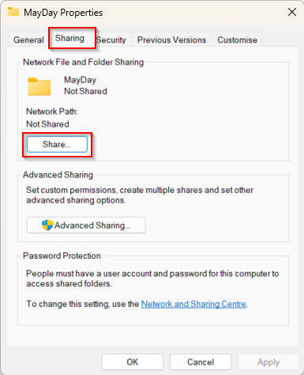

Voeg uzelf en iedereen die toegang moet hebben tot de add-in toe.
U heeft minstens Read/Write toegang nodig.
Klik op "Share" (Deel) en onthoud de netwerklocatie in het volgende scherm.

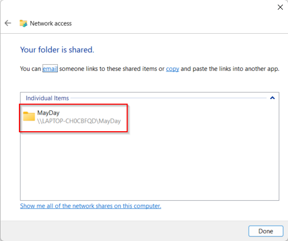

Kopieer het bestand "manifest.xml" dat u ter beschikking wordt gesteld naar de gedeelde folder.

Open hierna een nieuw document in Word en kies "File" (Bestand) en vervolgens "Options" (Opties).
Ga naar het "Trust Center" (Vertrouwenscentrum) en kies "Trust Center Settings" (Instellingen voor het Vertrouwenscentrum) en vervolgens "Trusted Add-in Catalogs" (Vertrouwde invoegtoepassingen).
Onder de "Catalog Url" vult u de netwerklocatie van de gedeelde folder in en voeg deze toe.
Zorg dat het vinkje onder "Show in Menu" aangevinkt is.

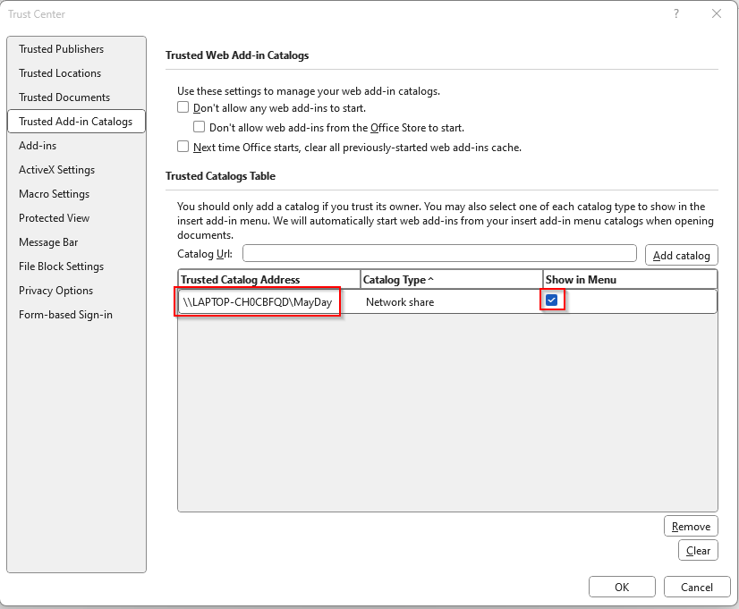

Klik op "Ok" en start Word opnieuw op.

Klik vervolgens op "Home" (Start) en dan "Add-ins". Kies hierna "More Add-ins" (Meer Add-ins).
In het scherm dat opent gaat u naar "Shared Folder" en kies vervolgens de folder die u gedeeld heeft.

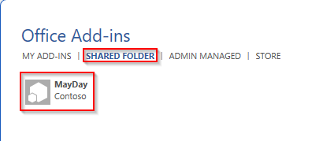

Klik op "Add" (Toevoegen) om de add-in toe te voegen. De add-in wordt bovenaan in de ribbon getoond.

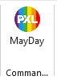

U kan deze link volgen voor een uitgebreidere handleiding:

[installatievideo](https://youtu.be/XXsAw2UUiQo)

### 1.2 Technische installatie

Dit deel is bedoeld voor iedereen die de solution wil testen en opstarten.

Om de solution te builden voert u volgend commando uit:

`npm run build`

De solution opstarten kan met:

`npm run start:desktop`

Voordat u de testen gaat uitvoeren, voer volgend commando uit:

`npx office-addin-usage-data off`

De testen kan u uitvoeren met:

`npm run test` of `npm run test:only`

Om de solution te deployen voert u volgend commando uit:

`npm run build && npm run start`

Dit start ook de express server.

Wanneer de add-in opgestart is, wordt er een zijpaneel geopend waarin alle functionaliteit te vinden is.
Het is mogelijk om dit zijpaneel te openen of te sluiten via de knop in het lint.

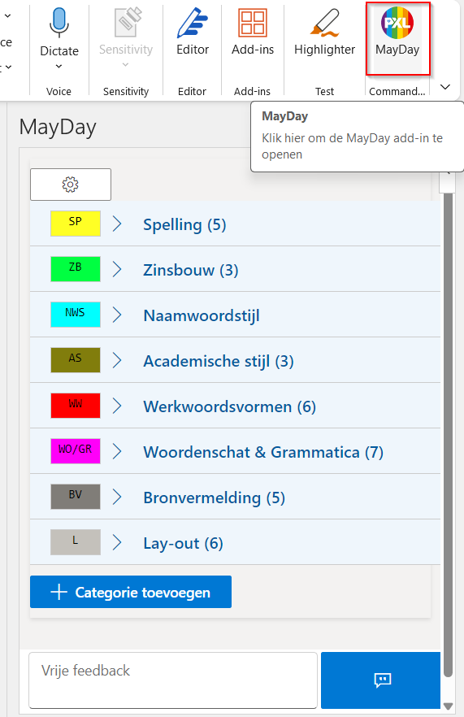

## 2 Tekst invoegen en markeren

### 2.1 Categorie en (sub)subcategorie

Om tekst te markeren en de commentaar erachter in te voegen, moeten 1 of meerdere woorden geselecteerd zijn.
Zonder een selectie, zal er geen tekst worden gemarkeerd of ingevoegd.

De ingevoegde commentaar wordt de eerste keer volledig getoond, daarna wordt enkel de code en eventueel bijhorende nummering van de (sub)subcategorie getoond.

Er zijn 3 niveaus om tekst in te voegen, de hoofdcategorie, de subcategorie en de subsubcategorie.

Om tekst te markeren en in te voegen vanuit de hoofdcategorie, klikt u op het kleurenvierkantje in de hoofdcategorie.

Een klik op de omschrijving van de hoofdcategorie opent de sub- en subsubcategorieën.
Om de tekst vanuit de sub- en subsubcategorieën te markeren en in te voegen, klikt u op de beschrijving.

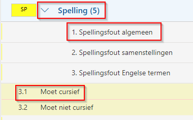

De eerste keer wordt de volledige omschrijving toegevoegd, daarna enkel de code.

Voorbeeld categorie:

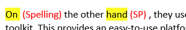

### 2.2 Vrije commentaar invoegen

#### Algemeen

Het is ook mogelijk om tekst in te voegen zonder tekst te markeren via het vrije feedback vak onderaan.

Dit kan handig zijn om extra feedback te voorzien bij bepaalde fouten.
Dit is de enige situatie waarin het niet vereist is dat er een selectie is.
De tekst wordt in het rood ingevoegd op de plaats van de cursor en wordt altijd volledig weergegeven.
Het invoegen gebeurt door op de blauwe knop te klikken of door de enter toets.
Annuleren kan door op de escape toets te drukken.

Voorbeeld:

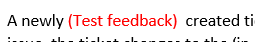

#### Categorie zonder subcategorieën

Als een categorie geen (sub)subcategorieën heeft, wordt er een vak getoond om vrije feedback in te voegen.

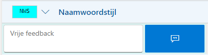

Een selectie is hier vereist!

Als de vrije feedback leeg gelaten wordt, zal de selectie gemarkeerd worden en wordt de titel erachter geplaatst.
Met vrije feedback wordt deze ingevoegd net na de titel.

Voorbeeld:

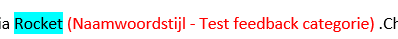

### 2.3 Commentaar met een hyperlink invoegen

Het is voor subsubcategorieën ook mogelijk om een hyperlink mee te geven.
Deze wordt achteraan bij ingevoegd als een klikbare hyperlink.

Voorbeeld:

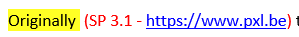

## 3 Items toevoegen, verwijderen en wijzigen

### 3.1 Categorie

#### Toevoegen

Klik op "Categorie toevoegen" om een nieuwe categorie toe te voegen.

Vervolgens wordt er een scherm geopend waar u alle informatie van de categorie kan invullen.

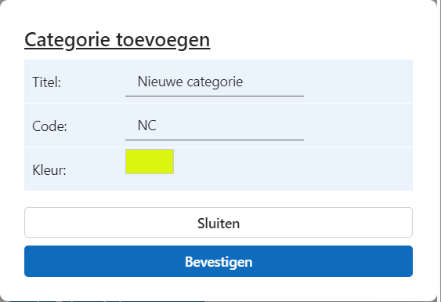

Klik op "Bevestigen" om de nieuwe categorie toe te voegen. De nieuwe categorie wordt onderaan toegevoegd.

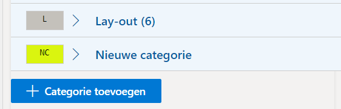

**Opmerking kleurenkiezer**

In deze add-in bent u niet beperkt tot de 16 standaard kleuren die Word aanbiedt om tekst te markeren.
Tijdens het aanmaken van de categorie kan u op het kleurvakje klikken om de kleurenkiezer te openen.

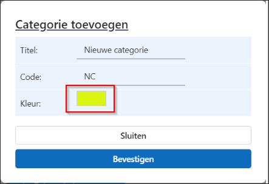

In deze kleurenkiezer kan u eender welke kleur kiezen om tekst te markeren.
Er wordt een voorbeeld getoond om te laten zien hoe het contrast is met zwarte tekst.
Als de kleur een slecht contrast heeft met zwarte tekst, zal er onderaan een waarschuwing verschijnen.

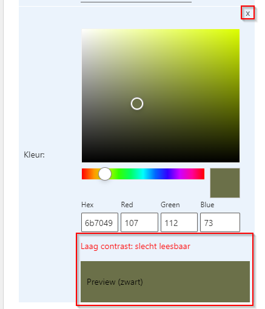

Als u een categorie aanmaakt met een kleur die een slecht contrast heeft met zwart, zal er een extra waarschuwing komen.
Als u "Ja" kiest wordt de categorie aangemaakt met de gekozen kleur. "Nee" zorgt ervoor dat u terug gaat en een nieuwe kleur kan kiezen.

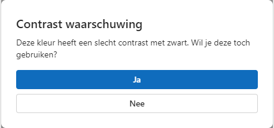

#### Wijzigen en verwijderen

Klik met de rechtermuisknop op een categorie om het menu te openen.

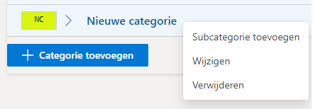

Als u "Wijzigen" kiest, opent het scherm om de categorie te wijzigen.
Alle gegevens van de gekozen categorie zijn ingevuld en kunnen gewijzigd worden.
Dit scherm heeft verder dezelfde functionaliteit als een categorie toevoegen, enkel zal de gekozen categorie aangepast worden met de nieuwe gegevens.

"Verwijderen" zorgt ervoor dat de gekozen categorie verwijderd wordt.
**Opgelet!** Deze actie is onomkeerbaar en verwijdert ook alle sub- en subsubcategorieën!

### 3.2 Subcategorie

#### Toevoegen

Klik met de rechtermuisknop op een categorie om het menu te openen.

Kies "Subcategorie toevoegen" om een subcategorie toe te voegen onder de gekozen categorie.
In het scherm dat opent, is de categorie al ingevuld.
De beschrijving van de subcategorie moet ingevuld worden voordat u kan bevestigen.

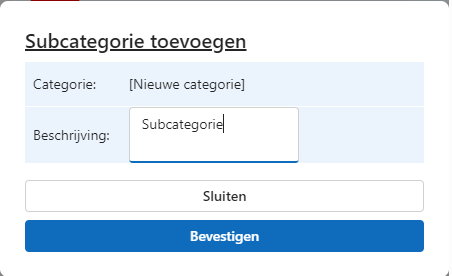

Nadat u de nieuwe subcategorie bevestigd, wordt deze toegevoegd onder de gekozen categorie.

#### Wijzigen en verwijderen

Houd de muis op de subcategorie om de knoppen om te wijzigen en te verwijderen zichtbaar te maken.

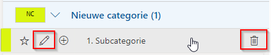

Klik op het potloodje om de subcategorie te wijzigen.

Voer de nodige wijzigingen door aan de beschrijving. Bevestigen gebeurt met de enter knop en annuleren kan met de escape knop.

Klik op het vuilbakje om de subcategorie te verwijderen.
**Opgelet!** Deze actie is onomkeerbaar en verwijdert ook alle subsubcategorieën!

### 3.3 Subsubcategorie

#### Toevoegen

Als u de muis op een subcategorie houdt, wordt ook de knop om een subsubcategorie toe te voegen zichtbaar.

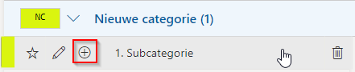

Klik op het plusje en u kan een nieuwe subsubcategorie toevoegen.

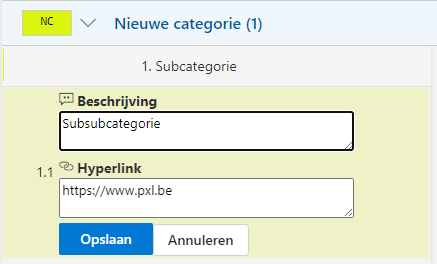

Vul een beschrijving in en u kan optioneel ook een hyperlink toevoegen.
Nadat u op "Opslaan" klikt, wordt de nieuwe subsubcategorie toegevoegd onder de gekozen subcategorie.

Met hyperlink:

Zonder hyperlink:

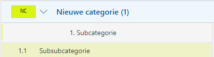

#### Wijzigen en verwijderen

Houd de muis op de subsubcategorie om de knoppen om te wijzigen en te verwijderen zichtbaar te maken.

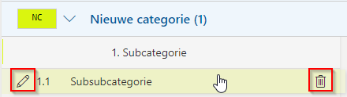

Klik op het potloodje om de subsubcategorie te wijzigen.

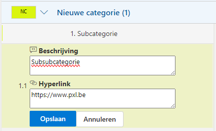

Voer de nodige wijzigingen door aan de beschrijving of de hyperlink en kies "Opslaan".

Klik op het vuilbakje om de subsubcategorie te verwijderen. **Opgelet!** Deze actie is onomkeerbaar!

## 4 Favorieten

Het is mogelijk om subcategorieën favoriet te maken.
Dit gebeurt door te klikken op het sterretje dat zichtbaar wordt als u de muis op de subcategorie houdt.

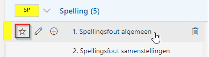

## 5 Instellingen

Om de instellingen te openen, klikt u op het tandwieltje bovenaan.

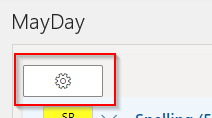

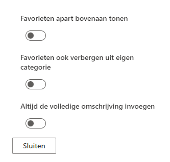

Vinkt u "Favorieten apart bovenaan tonen" aan, dan zullen de favorieten ook in een aparte categorie "Favorieten" bovenaan getoond worden.

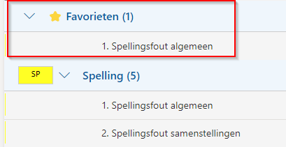

"Favorieten ook verbergen uit eigen categorie" zorgt ervoor dat de favorieten niet dubbel in de lijst staan.

Als het nodig is om toch nog eens de volledige commentaar in te voegen, kan u "Altijd de volledige omschrijving invoegen" aanvinken.
Dit zorgt ervoor dat steeds de volledige omschrijving wordt ingevoegd en niet enkel de code.

Er zijn ook enkele import en export functionaliteiten toegevoegd.

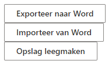

Als u exporteert naar Word, zal er een json tekst gegenereerd worden met alle informatie voor de add-in.
Deze kan dan gekopieerd worden naar Word op een andere laptop met de add-in geïnstalleerd.
Importeer deze informatie door op de knop te klikken en de categorieën en andere informatie worden geïmorteerd.

Moest u terug willen keren naar enkel de begincategorieën, kies dan "Opslag leegmaken".
Start de add-in terug op en enkel de begincategorieën zullen opnieuw ingeladen worden.